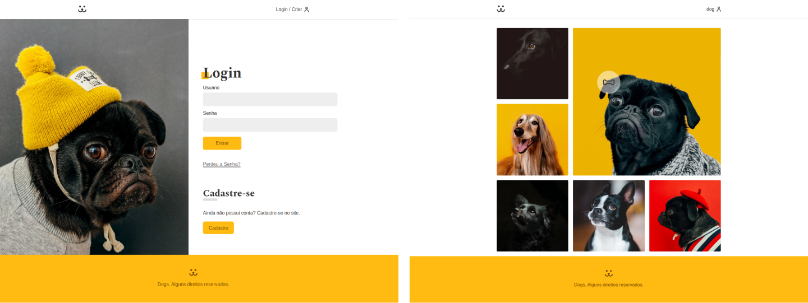
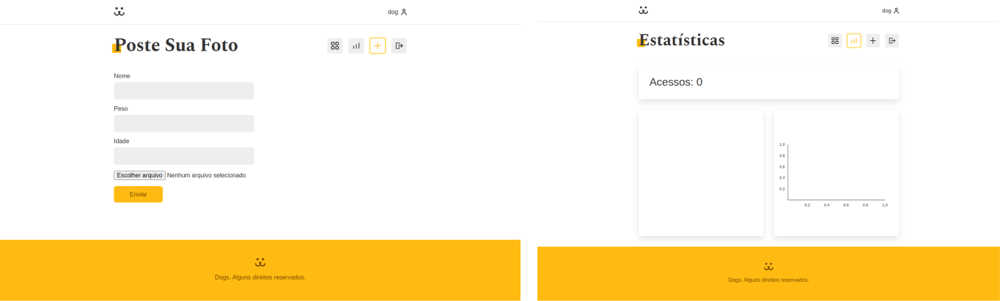

<h1 align="center">
	<a href="#"> Dogs</a>
</h1>
<p align="center">Uma rede social para pets 🐕 | 🐈.</p>
<h5 align="center">
	🚧   Em construção  🚧
</h5>

### Sobre o app

Crie seu cadastro e poste as fotos do seu pet, e faça amizade com outros amantes de pets. Comente e curta fotos dos seus amigos que também adoram seus bichinhos.

### Layout

<br />
<p>Login e Página inicial:</p>
<h1 align="center">
  
</h1>

<p>Perfil e Postagem de fotos:</p>
<h1 align="center">
  
</h1>

### Autor - Projeto original

- Curso React Completo:
  [André Rafael - Origamid](https://www.origamid.com/)

### Pré-requisitos

Para rodar o app garanta que você tenha as seguintes ferramentas: [Git](https://git-scm.com), [Node.js](https://nodejs.org/en/).

### Rodando ao app

Clone este repositório

```
git clone https://github.com/mayromyller/dogs-pet-social-network.git
```

Acesse a pasta

```
cd dogs/
```

Instale as dependências

```
yarn install
```

ou

```
npm install
```

Rode em modo desenvolvedor

```
yarn start
```

ou

```
npm run start
```

A aplicação irá rodar em: [http://localhost:3000](http://localhost:3000)

Caso queria testar essa aplicação já rodando em produção (com as últimas atualizações feitas), abra aqui: [Dogs](https://dogs-pet-social-network.mayromyller.vercel.app/)

### Tecnologias

As seguintes ferramentas foram usadas na construção do projeto:

- [Node.js](https://nodejs.org/en/)
- [React](https://pt-br.reactjs.org/)
- [React Router Dom](https://github.com/ReactTraining/react-router/tree/master/packages/react-router-dom)
